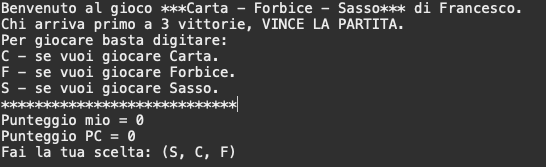

# SassoCartaForbice 👊 🖐 🖖

Hai mai giocato al famoso "Sasso Carta Forbice"? Probabilmente la risposta è si. 
Nella realtà quando hai un avversario umano entra in gioco la psicologia. Con il computer questa si annulla, rendendo estremamente causale la vittoria.

Il programma è molto semplice, basta scaricarlo e avviare il Main.java da Terminale.

Non ti resta che scegliere tra Carta Sasso e Forbici. 

    

#### If you find this helpful, please leave a star. 🌟
